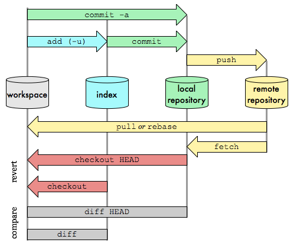

# Summary Figure

## 1. 概览图


## 2. 示例
### 2.1 push
```bash
git push origin my-feature:master
git push origin my-feature
```
- `git push <远程仓库名称> <本地分支名称>:<远程分支名称>`。在这里，`my-feature` 是你的本地分支名称，`master` 是你希望将其推送到的远程分支名称。完成推送后，你的本地分支的更改将被合并到远程的 `master` 分支。
- 默认情况：本地分支push到同名的远程分支。

### 2.2 pull
```bash
git pull origin master
git pull --rebase origin master
```
- `git pull` = `git fetch` + `git merge`
- `git pull --rebase` = `git fetch` + `git rebase`
- `git pull` 会将远程分支的更新合并到本地分支，`git pull --rebase` 会将本地分支的更新合并到远程分支。
- `git pull --rebase` 会将本地分支的提交历史修改为线性，而 `git pull` 会保留本地分支的提交历史。

### 2.3 merge
```bash
# git checkout master (cd to master branch)
git merge my-feature
git merge --no-ff my-feature
```
- `--no-ff` 参数，表示禁用 `Fast forward`，强制 Git 在执行合并时生成一个新的提交对象(从分支历史上看出分支信息)。
- `Fast forward` 是 Git 在执行合并时的默认行为，它会在没有必要创建新的提交对象的情况下，直接将 `master` 分支指向 `my-feature` 分支。
- `Fast forward` 的缺点是，会丢失分支信息，因为 `master` 分支没有发生变化，它的历史记录仍然是一条直线。

### 2.4 rebase
```bash
# git checkout my-feature (cd to my-feature branch)
git rebase master
```
- `git rebase` 会将 `my-feature` 分支的提交历史修改为线性，而 `git merge` 会保留 `my-feature` 分支的提交历史。
- `git rebase` 会将 `my-feature` 分支的每个提交对象应用到 `master` 分支上，而 `git merge` 会将 `my-feature` 分支的最新提交对象的快照合并到 `master` 分支上。
- `git rebase` 可以与 `cherry-pick` 协同理解：执行`git rebase`后依次将当前（执行rebase时所在分支）的提交cherry-pick到目标分支（待rebase的分支）上，然后将在原始分支（执行rebase时所在分支）上的已提交的commit删除。
```bash
# <commit_id1> <commit_id2> 或区间 <commit_id1>..<commit_id4>
git cherry-pick <commit-hash>  
git cherry-pick my-feature  # 选择其他分支上的提交并应用到当前分支
```

### 2.5 reset
```bash
git reset --hard HEAD^
git reset --hard HEAD^^
git reset --hard HEAD~100
git reset --hard <commit-hash>
```
- `git reset` 用于撤销提交，它有三个参数，分别是 `--soft`、`--mixed` 和 `--hard`。
- `--soft` 参数表示撤销提交，但是不撤销更改，也就是说，你可以重新提交这些更改。
- `--mixed` 参数表示撤销提交，并且撤销更改，也就是说，你不能重新提交这些更改。
- `--hard` 参数表示撤销提交，并且撤销更改，也就是说，你不能重新提交这些更改，并且你的工作目录会被重置为上一次提交时的状态。
- `HEAD^` 表示上一次提交，`HEAD^^` 表示上上次提交，`HEAD~100` 表示上一百次提交，`<commit-hash>` 表示指定的提交`id`。

### 2.6 其他
```bash
git log --graph --pretty=oneline --abbrev-commit
git config --global alias.st status  # 全局别名（简写）
# add / commit / branch / checkout / switch / tag / stash / 
# clone / fetch / remote / status / diff / show / reflog / 
# config / rm / mv / init / revert / archive
```

## 2. 参考资料
- [1] [廖雪峰Git教程](https://www.liaoxuefeng.com/wiki/896043488029600/897271968352576)
- [2] [Git笔记-颜老师](https://yanhaijing.com/git/2014/11/01/my-git-note/)
- [3] [Git官网](http://git-scm.com)
- [4] [Git merge与rebase的区别](https://blog.csdn.net/michaelshare/article/details/79108233)