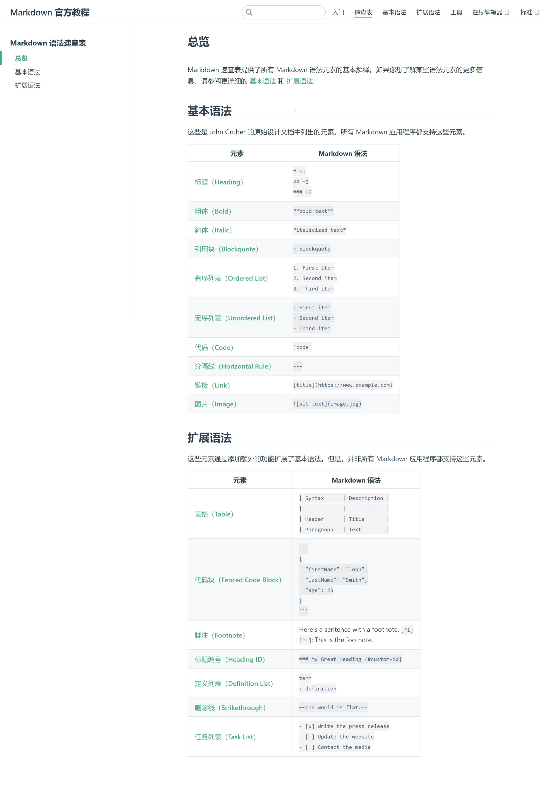

## 1. 概览图


## 2. 实例

### 2.1 表格
| One | Two | Three |
|---|---|---|
| 4 | 5 | 6 |
| 7 | 8 | 9 |


### 2.2 代码块
```python
import numpy as np

def func():
    pass
```

### 2.3 公式
$$
\begin{aligned}
\frac{\partial L}{\partial w} &= \frac{1}{N} \sum_{i=1}^N \frac{\partial L_i}{\partial w} + \lambda w \\
\frac{\partial L}{\partial b} &= \frac{1}{N} \sum_{i=1}^N \frac{\partial L_i}{\partial b}
\end{aligned}
$$

### 2.4 脚注
这是一个脚注[^1]。

[^1]: 脚注的内容。

### 2.5 引用
> 这是一个引用。

### 2.6 列表
- 无序列表
  - 无序列表

1. 有序列表
   1. 有序列表
   
term
: definition
: methods

### 2.7 任务列表
- [x] 任务1
- [ ] 任务2


## 3. 参考资料
- [1] [中文官方教程大全](https://markdown.com.cn/basic-syntax/)